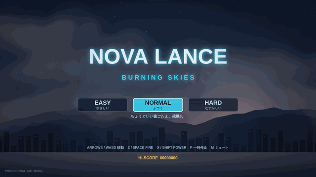

# NOVA LANCE — Burning Skies

A high-production browser **horizontal shoot-'em-up** (Gradius-style) — pick **EASY / NORMAL /
HARD**, then fight through 3 stages, each with a mid-stage mini-boss and a full boss, against a
varied enemy roster (fighters, drones, weavers, turrets, gunships, drone-carriers),
a full power-up arsenal, "learn-it-and-you-win" trap design, infinite continues, synthesised
chiptune audio, and a built-in mecha-SF art style that runs anywhere. No build step, no
dependencies to *play* — just open it.



---

## ▶ Play it

**Option A — simplest:** double-click **`index.html`**. It runs straight from `file://`.

**Option B — local server (recommended, also enables AI-art loading):**
double-click **`start.command`** (macOS) or run:

```bash
node tools/serve.js 8080      # or: python3 -m http.server 8080
# then open http://localhost:8080/
```

**Option C — phone / tablet on the same Wi-Fi:**
1. Run `start.command` (or the server above) on your computer.
2. It prints a `Phone : http://<your-LAN-IP>:8080/` line — open that URL on the phone.
3. Hold the device **sideways** (landscape). On-screen FIRE / POWER buttons and a drag-to-move
   pad appear automatically on touch devices.

---

## 🙌 Easy to pick up

Built to be approachable for everyone: a **difficulty selector** on the title
(EASY gives 5 lives, slower enemy fire and frequent power-ups; HARD is for veterans),
**infinite continues**, **1UP extends** at score milestones (50k / 150k / 300k / +200k),
a short **HOW TO PLAY** prompt at the start of stage 1, clearly-readable enemy bullets, a
visible player hitbox marker, and a "die-once-then-get-warned" trap system so nobody is stuck. Choose with ← → (or tap a
button) and start with Z / Space / Enter / click.

## 🎮 Controls

| Action | PC | Touch |
|---|---|---|
| Move | Arrow keys / WASD, or hold-mouse to steer | drag on the left half of the screen |
| Fire | `Z` / `Space` / left-click | **FIRE** button |
| Power (activate meter slot) | `X` / `Shift` / right-click | **POWER** button |
| Pause | `P` | — |
| Mute | `M` | — |

### Power meter (Gradius-style)
Collect **P capsules** to advance the cursor along the bottom meter, then press **POWER** to
activate the highlighted slot:

`SPEED · MISSILE · DOUBLE · SPREAD(3-way) · LASER · OPTION(drone) · SHIELD`

Capsules drop frequently — especially early — so your loadout changes fast and the attack
never stays one-note. **OPTION** drones (up to 3) trail you and mirror your fire; **SHIELD**
absorbs up to 3 hits; **LASER** is a continuous multi-layer beam.

---

## 💀 "First run you die, learn it and you always win"

Each stage hides fair-but-deadly traps:

- **Rear ambush** — enemies streak in from *behind* you.
- **Press machines** — ceiling/floor crushers that telegraph before slamming (Stage 2).
- **Falling debris** — drops from the top.
- **Fake capsules** — a red `?` capsule that *hurts* instead of helping.

The first time a trap kills you, the game **remembers it** (saved locally) and shows a
flashing **⚠ warning** before that trap from then on. Lives + **infinite continues** keep
you in the fight.

---

## 🎨 Visuals

The game ships with a detailed **procedural mecha-SF** art set (ships, enemies, bosses, bullets,
multi-layer explosions, additive-glow lasers, missile flame+smoke trails, muzzle flashes,
shockwave rings, screen shake) — so it looks good with **zero external files**.

### Optional: real AI art via gpt-image-2
`tools/generate_assets.py` generates "real mecha-SF" sprites with **OpenAI gpt-image-2** and
keys out a green screen to transparency (gpt-image-2 has no native alpha), plus landscape-only
backgrounds. The game **auto-loads** them in place of the procedural sprites.

```bash
export OPENAI_API_KEY=sk-proj-...        # needs billing + Verified Organization
pip install pillow
python3 tools/generate_assets.py         # writes assets/*.png, flips manifest "generated": true
# relaunch via start.command (server mode) to see the AI art
```

> Heads-up: image generation requires network access to `api.openai.com` and a verified org.
> If you ran this project inside a sandboxed CI/cloud environment, that call is typically
> blocked — run the generator on your own machine. Until then the game stays in procedural mode
> (title screen shows `PROCEDURAL ART MODE` vs `AI ART: ON`).

---

## ✅ Quality assurance

```bash
node qa/qa.js     # headless-Chrome QA: screenshots + boss-hit verification
node qa/flow.js   # end-to-end state-machine + balance integration test
node qa/gif.js    # record a real playthrough and build demo.gif
```

`qa/qa.js`:
- boots the game through the local server and **fails on any console error** (currently **0**),
- screenshots the **title, all 3 stages, and all 3 bosses** into `qa/shots/`,
- spawns **every enemy type** and lets them actually fire/launch (catches bad projectile data),
- **numerically verifies** that hitting each boss's **core weak point reduces its HP** — both via
  a direct hit-test and by spawning a real player shot and resolving collisions (armour never
  blocks the core),
- verifies the **mini-boss** takes damage and can be destroyed,
- regression-checks that recycled enemy-pool objects carry no stale state.

`qa/flow.js` drives the **real transitions**: boss defeat → STAGE CLEAR → next stage → … →
VICTORY, plus the death → CONTINUE → resume and CONTINUE-timeout → GAME OVER paths, and a
balance sanity check on how long each boss survives sustained fire.

---

## 📁 Structure

```
index.html            entry point (classic scripts -> file:// safe)
css/style.css         layout, touch UI, loading splash
js/
  util.js             math, RNG, object pool, save/load
  audio.js            Web Audio chiptune BGM + SFX (no files)
  assets.js           procedural sprite baking + optional AI-art loading
  input.js            keyboard / mouse / touch
  effects.js          particles, explosions, trails, shake, hit-stop
  weapons.js          player shots, missiles, laser, enemy bullets
  powerup.js          Gradius power meter + capsules (incl. fake trap)
  player.js           ship: movement, banking, afterimage, weapons, options, shield
  enemies.js          enemy types, mini-boss, traps (ambush / press / debris)
  bosses.js           3 bosses; core is always hittable by design
  stages.js           parallax landscape backgrounds + spawn timelines
  ui.js               HUD, power meter, boss bar, title, menus, warnings
  game.js             state machine, loop, collisions, scoring, continues
  main.js             bootstrap, responsive scaling, loading
tools/serve.js        zero-dep static server (used by start.command + QA)
tools/generate_assets.py   gpt-image-2 + chroma-key art pipeline
qa/qa.js              headless QA (screenshots + boss hit verification)
qa/gif.js, make_gif.py     demo GIF capture/assembly
start.command         double-click launcher + LAN address for phones
```

All original work — no third-party game assets or trademarks.
